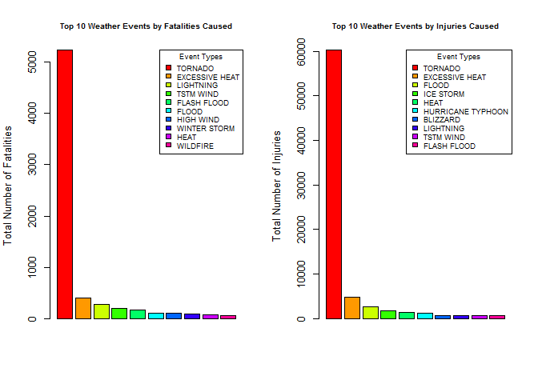
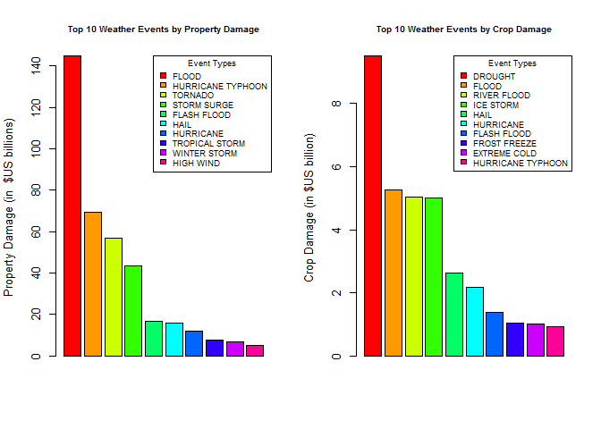

**Synopsis** This project is an exploration of the U.S. National Oceanic
and Atmospheric Administration's (NOAA) storm database. This database
tracks characteristics of major storms and other weather events in the
United States, including when and where they occur, as well as estimates
of any fatalities, injuries, and property damage.

The raw NOAA data need to be preprocessed to combine some redundant
event type categories, and to re-format certain fields as numeric, in
order to calculate sums of mortalities, injuries, and property and crop
damage totals by the corrected event types.

The results of the analysis show that:

-   The most severe weather event is a 'Tornado'. This single event type
    caused 4,861 fatalities from 1950-2011.

-   'Flood' is the top weather event source of economic loss, causing
    more than $144 billion in property damage.

-   'Drought'is the top weather event source of crop loss, causing over
    $9 billion in property damage.

**Data Processing**

The first step in the analysis is to unzip the the folder and **read in
the CSV file 'repdata-data-StormData.csv'** from the local working
directory.

    #setwd("~/Data Science Training/Coursera/Data Science Specialization/Course 5 Reproducible Research/Week 4/Data")

    URL<-"https://d396qusza40orc.cloudfront.net/repdata%2Fdata%2FStormData.csv.bz2" 
    download.file(url=URL, destfile = "./repdata-data-StormData.csv.bz2")
    StormData <- read.csv("repdata-data-StormData.csv.bz2",head=TRUE)

    dim(StormData)

    ## [1] 902297     37

    #head(StormData)

Next, limit to the variables of interest:

    #sessionInfo()

    ColSubset <- c("STATE", "EVTYPE", "FATALITIES", "INJURIES", "PROPDMG", "PROPDMGEXP", "CROPDMG", "CROPDMGEXP")
    StormData_Sub <- StormData[ColSubset]

IN the raw NOAA data set, many different event type labels from the
variable EVTYPE represent the same event, such as those several ones
whose relevant event type is tornado.

Data preprocessing is therefor needed in order to combine these very
similar types together, as well as those with text strings that are
intended to be identical. For example, the 2 event type labeles "FLASH
FLOOD/FLOOD" and "FLASH FLOOD/ FLOOD" are refering to the same event
type, but the second label text string has some extra blanks before the
final "FLOOD".

In this step, apply data cleaning, after which the label text issues
will be resolved, and the number of unique event types should decrease,
and be more meaningful.

    ## number of unique event types
    length(StormData_Sub)

    ## [1] 8

    ## translate all letters to upper case
    event_types <- toupper(StormData_Sub$EVTYPE)
    ## clean up text by replacing punctuation characters with a space
    event_types <- gsub("[[:blank:][:punct:]+]", " ", event_types)
    ## update the data frame
    StormData_Sub$EVTYPE <- event_types
    ## number of unique event types
    length(unique(StormData_Sub$EVTYPE))

    ## [1] 874

There are also some values of the FATALITIES variable in text string
form, or otherwise out of range. So, we select only its value with
postive numeric values, and for which the value of event type is not
blank.

    StormData_Sub1 <- subset(StormData_Sub, StormData_Sub$FATALITIES  %in% c("0":"999"))

    ## check the results
    unique(StormData_Sub1$FATALITIES)

    ##  [1]   0   1   4   6   7   2   5  25   3  10  14   9  11  23  22  21  50
    ## [18]  29  34  17   8  18  24  33  31  20  13  75  15  16  90 116  12  38
    ## [35]  57  30  37  36 114  26  42  27 583  67  19  32  99  74  49  46  44
    ## [52] 158

    ## convert the value to numeric type
    StormData_Sub1$FATALITIES <- as.numeric(as.character(StormData_Sub1$FATALITIES))
    ## select the value of FATALITIES is greater than zero, and the value of event type is not blank
    StormData_Sub2 <- subset(StormData_Sub1, StormData_Sub1$FATALITIES > 0 & !(StormData_Sub1$EVTYPE==""))

    summary(StormData_Sub2$FATALITIES)

    ##    Min. 1st Qu.  Median    Mean 3rd Qu.    Max. 
    ##   1.000   1.000   1.000   2.172   2.000 583.000

Next, perform the same data cleaning process for the INJURIES variable.

    StormData_Sub3 <- subset(StormData_Sub2, StormData_Sub$INJURIES  %in% c("0":"999"))
    ## check the results
    unique(StormData_Sub3$INJURIES)

    ##   [1]   14   26   50    8  195   12    3   20  200   90   15   35    6    1
    ##  [15]    2   25    0   24   11   88   72   44   47   63    7   60   41   29
    ##  [29]  110   80   36  250   22   49  130   23   51   19   37  463   13    9
    ##  [43]   40   17  325    5  180   39   57    4   18   16  270  350  257  112
    ##  [57]   10   64   28  100   52   45  500   30  450   21   94   33   75  300
    ##  [71]   65  152   55   31  115  410   97   69   56  181   27  252  560   42
    ##  [85]  275   38   34  175   73  138  172  156   43   91  177   59  150   58
    ##  [99]   70  225   85  165  266   32 1228   68  785  116  224  142   79   87
    ## [113]  504  140   78  123  192  342  411  154   98  176  170  216   53  118
    ## [127]  280  153  105  103  207  240 1150  190   81  135   95   82  166  137
    ## [141]  120  159  597  111   76   67 1700  121   54   71  385  230 1568  129
    ## [155]   48  246  258  145   96  122  143  600  800  119  241  397  160  293
    ## [169]  234  106  144  102  125   61  316   93   66  780   92  104  437  306
    ## [183]  519   77   46  700  223  210   NA

    ## convert the value to numeric type
    StormData_Sub3$INJURIES <- as.numeric(as.character(StormData_Sub3$INJURIES))
    ## select the value of INJURIES is greater than zero, and the value of event type is not blank
    StormData_Sub4 <- subset(StormData_Sub3, StormData_Sub3$INJURIES > 0 & !(StormData_Sub3$EVTYPE==""))

    summary(StormData_Sub4$INJURIES)

    ##    Min. 1st Qu.  Median    Mean 3rd Qu.    Max. 
    ##    1.00    2.00    5.00   29.82   20.00 1700.00

**Results**

-   Ranking the Most Harmful Weather Events To Public Health

Calculate and rank the number of fatalities by event type

    fatality <- aggregate(FATALITIES ~ EVTYPE, data=StormData_Sub4, sum)
    ## order the number of fatalities in decreasing 
    fatality_1 <- fatality[order(fatality$FATALITIES, decreasing = T), ]  

Calculate and rank the number of injuries by event type

    Injury <- aggregate(INJURIES ~ EVTYPE, data=StormData_Sub4, sum)

    ## order the number of injuries in decreasing 
    Injury_1 <-Injury[order(Injury$INJURIES, decreasing = T), ] 

Top 10 event types by fatality count

    head(fatality_1,10)

    ##            EVTYPE FATALITIES
    ## 68        TORNADO       5227
    ## 10 EXCESSIVE HEAT        402
    ## 48      LIGHTNING        283
    ## 71      TSTM WIND        199
    ## 15    FLASH FLOOD        171
    ## 16          FLOOD        104
    ## 36      HIGH WIND        102
    ## 80   WINTER STORM         85
    ## 27           HEAT         73
    ## 78       WILDFIRE         55

Top 10 event types by injury count

    head(Injury_1,10)

    ##               EVTYPE INJURIES
    ## 68           TORNADO    60187
    ## 10    EXCESSIVE HEAT     4791
    ## 16             FLOOD     2679
    ## 43         ICE STORM     1720
    ## 27              HEAT     1420
    ## 41 HURRICANE TYPHOON     1219
    ## 3           BLIZZARD      718
    ## 48         LIGHTNING      649
    ## 71         TSTM WIND      646
    ## 15       FLASH FLOOD      641

    par(mfrow = c(1, 2), mar = c(5.1, 4.1, 4.1, 2.1), mgp = c(3, 1, 0), las=3, cex = 0.8)
    barplot(fatality_1[1:10,2], col = rainbow(10), legend.text = fatality_1[1:10,1],
            args.legend = list(title = "Event Types", x = "topright",  cex = .7), 
            ylab="Total Number of Fatalities",
            main = "Top 10 Weather Events by Fatalities Caused", cex.main = .8)

    barplot(Injury_1[1:10,2], col = rainbow(10), legend.text = Injury_1[1:10,1],
            args.legend = list(title = "Event Types", x = "topright",  cex = .7), 
            ylab="Total Number of Injuries",
            main = "Top 10 Weather Events by Injuries Caused", cex.main = .8)

Tornado is the top severe weather event when event types are ranked both
by descending number of fatalities and of injuries, with 5,187
fatalities and 59,567 injuries from year 1950 to the end of November in
2011.

The second ranked event in each list is excessive heat. The third is
lighting for fatalities, and flood for injuries.

-   Ranking the Most Harmful Weather Events Measured by property damage
    and by crop damage

There are four variables (PROPDMG, PROPDMGEXP, CROPDMG, CROPDMGEXP) used
to calculate the cost of damages for property and crops. PROPDMGEXP and
CROPDMGEXP are represented in alphabetical characters which signify the
magnitude, and need to be converted to a numeric value.

Also, both variables need to be cleaned since some values are in pure
text. For example, CROPDMGEXP has the value "OKLAHOMA, Eastern".

    StormData_Sub1 <- subset(StormData_Sub, StormData_Sub$PROPDMGEXP  %in% c("0":"999",'h','H','k','K','m','M','b','B'))

    ## check the results
    unique(StormData_Sub1$PROPDMGEXP)

    ##  [1] K M B m 0 5 6 4 2 3 h 7 H 1 8
    ## Levels:  - ? + 0 1 2 3 4 5 6 7 8 B h H K m M

    ## convert the value to numeric type
    StormData_Sub1$PROPDMG <- as.numeric(as.character(StormData_Sub1$PROPDMG))

'h' and 'H' for hundred, 'k' and 'K' for thousand, 'm' and 'M' for
million, 'b' and 'B' for billion

    symbol_val <- c("", "+", "-", "?", 0:9, "h", "H", "k", "K", "m", "M", "b", "B")
    factor_val <- c(rep(0,4), 0:9, 2, 2, 3, 3, 6, 6, 9, 9)
    mult <- data.frame (symbol_val, factor_val)

Calculate the cost of property damage

    StormData_Sub1$PROP_DMG <- StormData_Sub1$PROPDMG*10^mult[match(StormData_Sub1$PROPDMGEXP,mult$symbol_val),2]
    damage_prop <- aggregate(PROP_DMG ~ EVTYPE, data=StormData_Sub1, sum)
    ## order the cost of damages in decreasing
    damage_prop1 <- damage_prop[order(damage_prop$PROP_DMG, decreasing = T), ]

Perform the same data processing for the crop variables

    StormData_Sub2 <- subset(StormData_Sub, StormData_Sub$CROPDMGEXP  %in% c("0":"9",'h','H','k','K','m','M','b','B'))

    ## check the results
    unique(StormData_Sub2$CROPDMGEXP)

    ## [1] M K m B 0 k 2
    ## Levels:  ? 0 2 B k K m M

    StormData_Sub2 <- subset(StormData_Sub2, StormData_Sub2$CROPDMG  %in% c("0":"999"))
    ## convert the value to numeric type
    StormData_Sub2$CROPDMG <- as.numeric(as.character(StormData_Sub2$CROPDMG))

Calculate the cost of crop damage

    StormData_Sub2$CROP_DMG <- StormData_Sub2$CROPDMG*10^mult[match(StormData_Sub2$CROPDMGEXP,mult$symbol_val),2]
    damage_crop <- aggregate(CROP_DMG ~ EVTYPE, data=StormData_Sub2, sum)

    ## order the cost of damages in decreasing
    damage_crop1 <- damage_crop[order(damage_crop$CROP_DMG, decreasing = T), ]

Top 10 property damage event types

    head(damage_prop1,10)

    ##                EVTYPE     PROP_DMG
    ## 58              FLOOD 144657709800
    ## 160 HURRICANE TYPHOON  69305840000
    ## 299           TORNADO  56947380614
    ## 251       STORM SURGE  43323536000
    ## 46        FLASH FLOOD  16822673772
    ## 88               HAIL  15735267456
    ## 152         HURRICANE  11868319010
    ## 307    TROPICAL STORM   7703890550
    ## 360      WINTER STORM   6688497251
    ## 137         HIGH WIND   5270046260

Top 10 crop damage event types

    head(damage_crop1,10)

    ##               EVTYPE   CROP_DMG
    ## 13           DROUGHT 9499446000
    ## 28             FLOOD 5254498000
    ## 85       RIVER FLOOD 5029459000
    ## 73         ICE STORM 5006660000
    ## 43              HAIL 2628328020
    ## 65         HURRICANE 2183600000
    ## 24       FLASH FLOOD 1368908000
    ## 38      FROST FREEZE 1043046000
    ## 21      EXTREME COLD 1015833000
    ## 70 HURRICANE TYPHOON  938202000

    par(mfrow = c(1, 2), mar = c(5.1, 4.1, 4.1, 2.1), mgp = c(3, 1, 0), las=3, cex = 0.8)
    barplot(damage_prop1[1:10,2]/10^9, col = rainbow(10), legend.text = damage_prop1[1:10,1],
            args.legend = list(title = "Event Types", x = "topright",  cex = .7), 
            ylab="Property Damage (in  $US billions)",
            main = "Top 10 Weather Events by Property Damage", cex.main = .8)

    barplot(damage_crop1[1:10,2]/10^9, col = rainbow(10), legend.text = damage_crop1[1:10,1],
            args.legend = list(title = "Event Types", x = "topright",  cex = .7), 
            ylab="Crop Damage (in $US billion)",
            main = "Top 10 Weather Events by Crop Damage", cex.main = .8)

**Conclusions** Tornado is by far the most life-threataning severe
weather event in the US from 1950-2011, while floods cause the most
economic damage, and draught the most crop damage.
